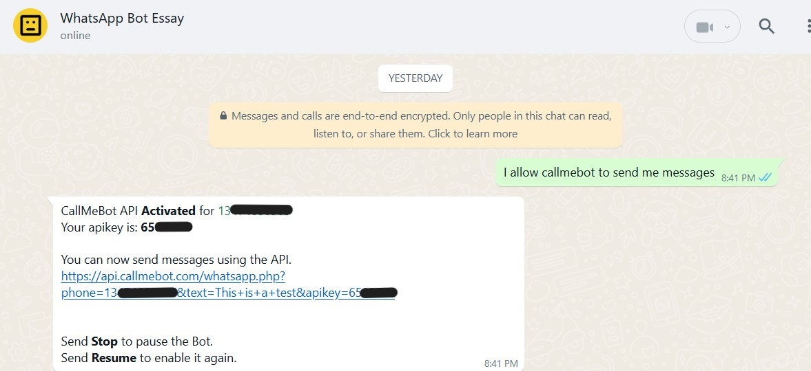
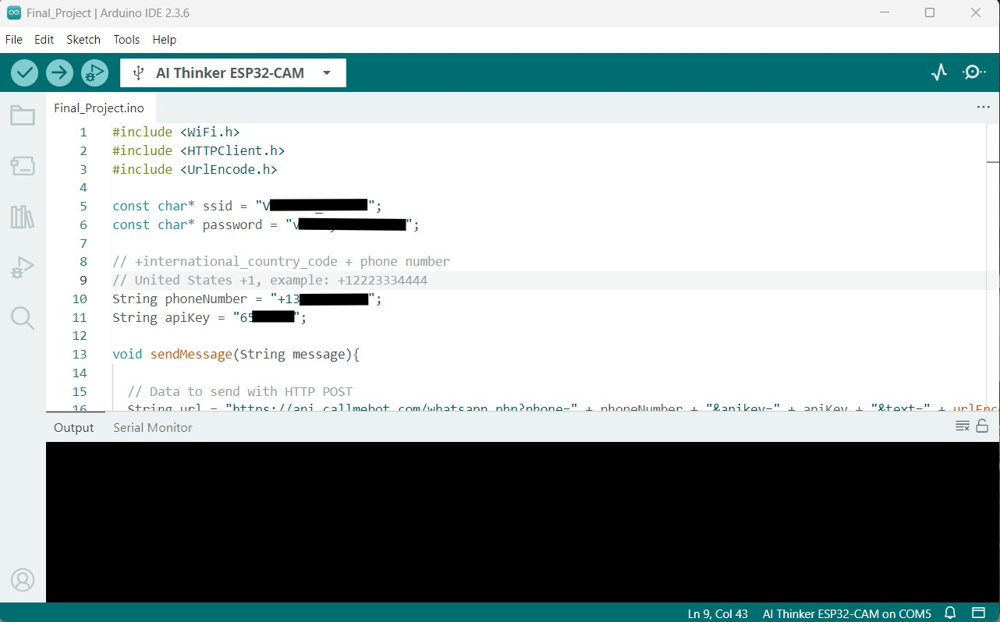
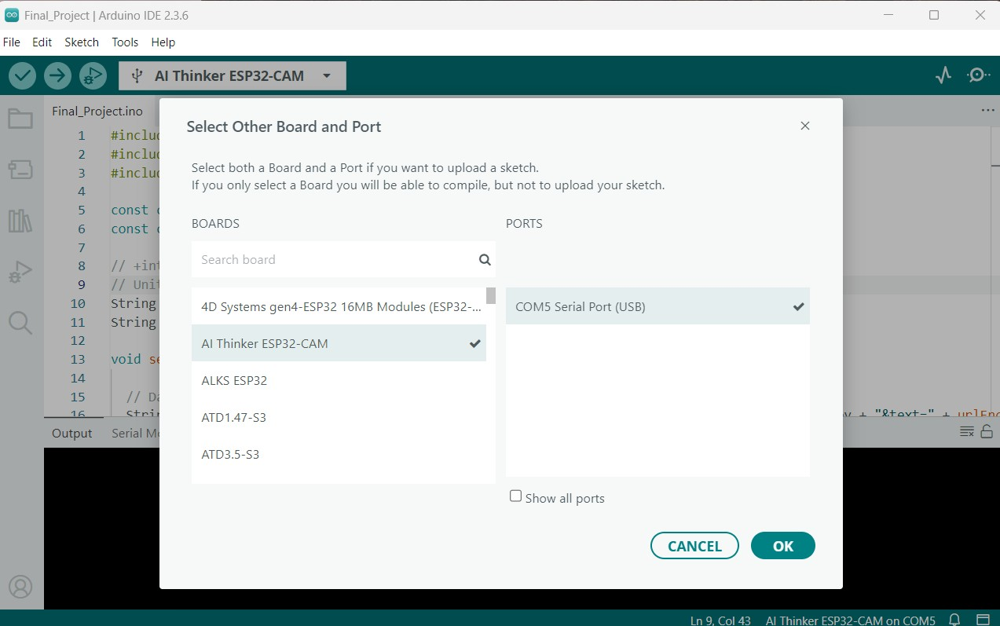
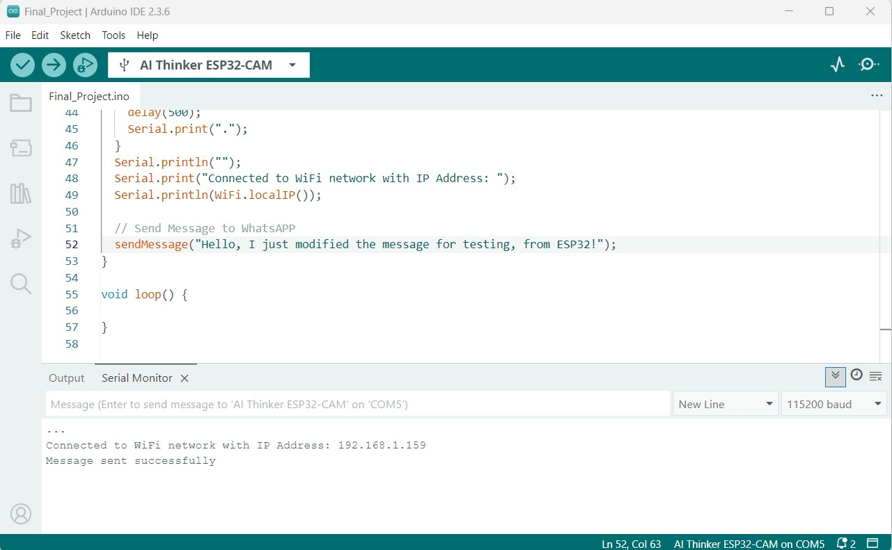
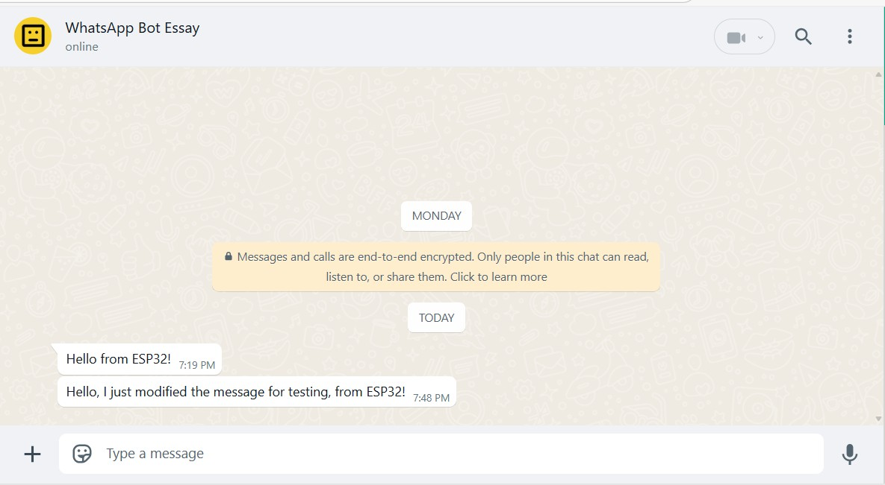

# ESP32-Send-Messages-WhatsApp
This example demonstrates how to send messages to WhatsApp using ESP32 along with Arduino IDE. For this to work we should install WhatsApp and Arduino IDE, and acquire ESP32 microcontroller. Launch Arduino and plug the ESP32Cam with the appropriate USB cable.

## Step 1: Getting the CallMeBot API KEY
To send messages to your WhatsApp account with the ESP32 along with Arduino, we’ll use a free API service called CallMeBot service. On Arduino:
* First, go to Select Other Board and Port > AI Thinker ESP32-CAM > COM? Serial Port (USB) > Ok to select the ESP32Cam (? could be any number)
* Then go to Sketch > Include Library > Manage Libraries and search for **URLEncode** library by Masayuki Sugahara and install it.
* After that, click this link [CallMeBot](https://www.callmebot.com/blog/free-api-whatsapp-messages/) and follow the instructions under **"Step:"** as show below:
1. Add the phone number **beginning with plus(+) sign** into your **Phone Contacts** and name it it as you wish.
2. Send this message **"I allow callmebot to send me messages"** to the new Contact created using WhatsApp.
3. Wait until you receive the message **"API Activated for your phone number. Your APIKEY is xxxxx"** from the bot.
Note: If you don't receive the ApiKey in 2 minutes, please try again after 24hs.
4. The WhatsApp message from the bot will contain the _**APIKEY**_ needed to send messages using the API.
5. Example
 
### Step 2: ESP32 Code (Copy and paste on Arduino IDE)
```
  /* 
  Rui Santos
  Complete project details at https://RandomNerdTutorials.com/esp32-send-messages-whatsapp/
  
  Permission is hereby granted, free of charge, to any person obtaining a copy
  of this software and associated documentation files.
  
  The above copyright notice and this permission notice shall be included in all
  copies or substantial portions of the Software.
*/

#include <WiFi.h>    
#include <HTTPClient.h>
#include <UrlEncode.h>

// your network credentials
const char* ssid = "REPLACE_WITH_YOUR_SSID";
const char* password = "REPLACE_WITH_YOUR_PASSWORD";

// +international_country_code + phone number
// United States +1, example: +151912345678
String phoneNumber = "REPLACE_WITH_YOUR_PHONE_NUMBER";
String apiKey = "REPLACE_WITH_API_KEY";

void sendMessage(String message){

  // Data to send with HTTP POST
  String url = "https://api.callmebot.com/whatsapp.php?phone=" + phoneNumber + "&apikey=" + apiKey + "&text=" + urlEncode(message);    
  HTTPClient http;
  http.begin(url);

  // Specify content-type header
  http.addHeader("Content-Type", "application/x-www-form-urlencoded");
  
  // Send HTTP POST request
  int httpResponseCode = http.POST(url);
  if (httpResponseCode == 200){
    Serial.print("Message sent successfully");
  }
  else{
    Serial.println("Error sending the message");
    Serial.print("HTTP response code: ");
    Serial.println(httpResponseCode);
  }

  // Free resources
  http.end();
}

void setup() {
  Serial.begin(115200);

  WiFi.begin(ssid, password);
  Serial.println("Connecting");
  while(WiFi.status() != WL_CONNECTED) {
    delay(500);
    Serial.print(".");
  }
  Serial.println("");
  Serial.print("Connected to WiFi network with IP Address: ");
  Serial.println(WiFi.localIP());

  // Send Message to WhatsAPP
  sendMessage("Hello from ESP32!");
}
```
## Step 3: Information to Make It Works
### 1. Enter your network credentials by replacing the words between the quotes:
* const char* ssid = "REPLACE_WITH_YOUR_SSID";
* const char* password = "REPLACE_WITH_YOUR_PASSWORD";
### 2. Enter your phone number and API key
* String phoneNumber = "REPLACE_WITH_YOUR_PHONE_NUMBER";
* String apiKey = "REPLACE_WITH_YOUR_API_KEY";
### 3. Write the message your to send by replacing the one into the quotes. Ensure the quotes should contain your written message.
* // Send Message to WhatsAPP
  sendMessage("Hello from ESP32!");


# Demonstration
After inserting your network credentials, phone number and API key, you can upload the code to your board.

After uploading, open the Serial Monitor at a baud rate of 115200 and press the board RST button. It should successfully connect to your network and send the message to WhatsApp.






## Troubleshooting

* **COM port not detected:** Check the USB cable connection and the USB to Serial driver installation.
* **HTTP response code: 203** Wrong credentials, phone number, and/or APIKEY entered.

## Resources

* CallMeBot: [Free-API](https://www.callmebot.com/blog/free-api-whatsapp-messages/)
* RandomNerdtutorials: [ESP-WhatsApp-Message](https://randomnerdtutorials.com/esp32-send-messages-whatsapp/)
